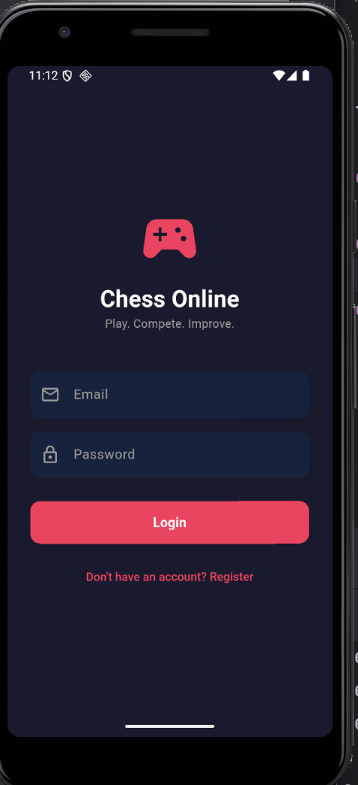
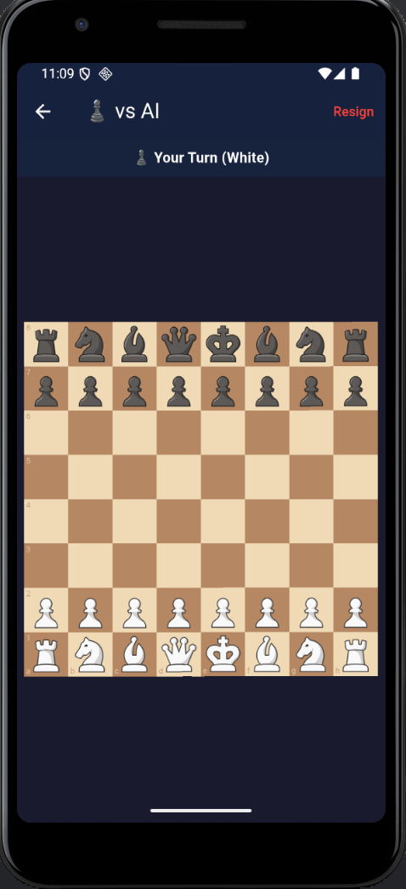
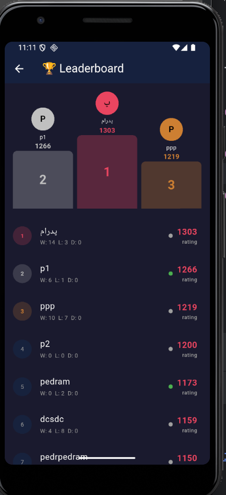
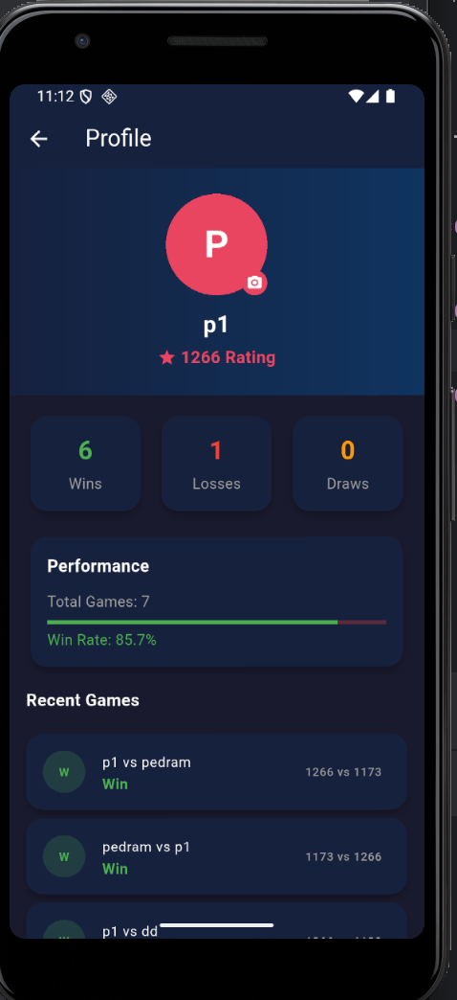

# ♟ Chess Online - Flutter + Node.js + MongoDB


## Screenshots

<p float="left">
  
  
  
  
  
</p>

## Stack
- **Frontend**: Flutter + GetX (MVC)
- **Backend**: Node.js + Express + MongoDB + Socket.IO
- **Auth**: JWT
- **Realtime**: Socket.IO for online games + chat

---

## Project Structure

```
chess_app/
├── backend/                  # Node.js server
│   ├── server.js             # Entry point
│   ├── socket.js             # Socket.IO game logic
│   ├── config/db.js          # MongoDB connection
│   ├── models/               # User, Game
│   ├── controllers/          # authController, userController
│   ├── routes/               # auth, users
│   └── middleware/auth.js    # JWT middleware
│
└── flutter_chess/            # Flutter app
    └── lib/
        ├── main.dart
        ├── app/              # theme.dart, routes.dart
        ├── models/           # UserModel
        ├── services/         # ApiService, SocketService
        └── controllers/      # AuthController, HomeController,
        │                       GameController, ProfileController,
        │                       LeaderboardController
        └── views/
            ├── auth/         # login, register
            ├── home/         # home (search + matchmaking)
            ├── game/         # online game, offline game
            ├── profile/      # profile + history
            └── leaderboard/  # top players
```

---

## 🚀 Setup

### Backend

```bash
cd backend
npm install
cp .env.example .env
# Edit .env and set your MONGO_URI and JWT_SECRET
mkdir uploads
npm run dev
```

### Flutter

```bash
cd flutter_chess
flutter pub get
flutter run
```

> ⚠️ In `lib/app/theme.dart`, change `AppConstants.baseUrl` and `socketUrl`:
> - Android emulator: `http://10.0.2.2:3000`
> - iOS simulator: `http://localhost:3000`
> - Real device: `http://<your-machine-ip>:3000`

---

## Features

| Feature | Status |
|---|---|
| Register / Login (JWT) | ✅ |
| Search players by username | ✅ |
| Random player matchmaking | ✅ |
| Online multiplayer (Socket.IO) | ✅ |
| Invite specific player | ✅ |
| Offline vs AI (simple random) | ✅ |
| Offline 2-player (local) | ✅ |
| Real-time chat during game | ✅ |
| Resign | ✅ |
| ELO rating system | ✅ |
| Leaderboard (Top 50) | ✅ |
| Player profiles + history | ✅ |
| Avatar upload | ✅ |
| Online presence indicator | ✅ |

---

## API Endpoints

```
POST /api/auth/register   { username, email, password }
POST /api/auth/login      { email, password }
GET  /api/auth/me         (auth required)

GET  /api/users/search?q= (auth required)
GET  /api/users/random    (auth required)
GET  /api/users/leaderboard
GET  /api/users/:id
PUT  /api/users/avatar    (multipart/form-data)
```

## Socket Events

| Event | Direction | Data |
|---|---|---|
| `join_queue` | Client → Server | — |
| `leave_queue` | Client → Server | — |
| `game_start` | Server → Client | `{ gameId, color, opponent }` |
| `invite_user` | Client → Server | `{ targetUserId }` |
| `accept_invite` | Client → Server | `{ fromSocketId, fromUserId }` |
| `make_move` | Client → Server | `{ gameId, move, fen }` |
| `opponent_move` | Server → Client | `{ move, fen }` |
| `game_over` | Client → Server | `{ gameId, result }` |
| `game_ended` | Server → Client | `{ result, ratingChange, newRating }` |
| `send_message` | Client → Server | `{ gameId, message }` |
| `new_message` | Server → Client | `{ senderId, message }` |
| `resign` | Client → Server | `{ gameId }` |
